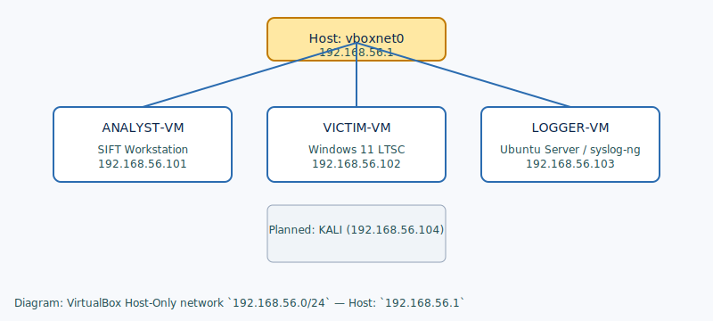

# My Personal DFIR & Blue Team Lab

**Author:** Lohith G

Project Objective: Design and build a lightweight, cost-effective, and isolated virtual lab environment using VirtualBox for digital forensics, malware analysis, and blue team monitoring.

This repository documents the lab architecture, setup steps, and standard operating procedures used to run a safe, repeatable DFIR (Digital Forensics & Incident Response) environment.

**Quick Links:**
- **Repository docs:** `docs/lab-architecture.md`, `docs/setup-and-sop.md`

**Project Highlights:**
- **Isolation:** Host-Only VirtualBox network (`192.168.56.0/24`) to keep the lab segregated from the host LAN and the internet.
- **Repeatability:** Snapshots are used as clean baselines for each VM to allow quick resets.
- **Centralized logging:** NXLog on Windows forwards logs to `syslog-ng` on the Logger VM for real-time monitoring.
- **Forensics tooling:** SIFT Workstation prepared for disk and memory analysis.

## Lab Topology (summary)
- Network: `192.168.56.0/24` (VirtualBox Host-Only)
- Host (vboxnet0): `192.168.56.1`
- Analyst (SIFT): `192.168.56.101`
- Victim (Windows): `192.168.56.102`
- Logger (Ubuntu/syslog-ng): `192.168.56.103`

See `docs/lab-architecture.md` for the VM sizes and detailed network design.

## Architecture Diagram

The diagram above is embedded from `docs/network-diagram.svg` and shows the Host-Only network and VM IPs.

## How to use this repo
- Read `docs/setup-and-sop.md` for step-by-step build and SOPs.
- Use the snapshot routines described in the SOP to restore a clean baseline before experiments.

## Future Roadmap
- Add offensive VM (Kali) for attack simulation (`192.168.56.104`).
- Upgrade Logger to ELK (Elasticsearch + Kibana) for visual dashboards.
- Add dedicated malware detonation snapshot and Active Directory scenarios.

## References & Tools
- VirtualBox
- SIFT Workstation (SANS)
- Ubuntu Server
- Windows LTSC (Eval)
- Sysinternals (Sysmon)
- NXLog Community Edition
- syslog-ng

---

For full documentation and step-by-step notes, open `docs/lab-architecture.md` and `docs/setup-and-sop.md`.
